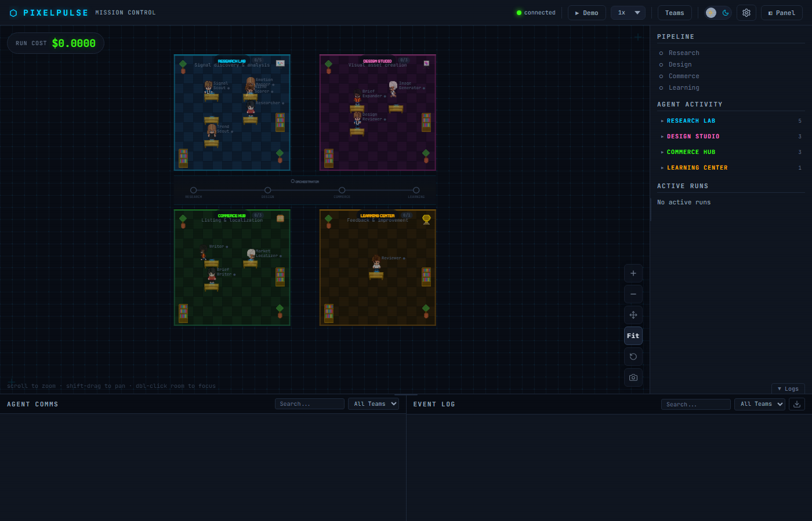
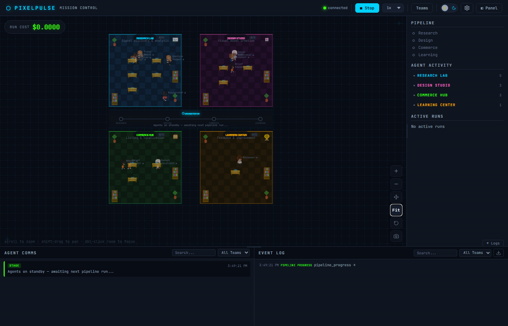
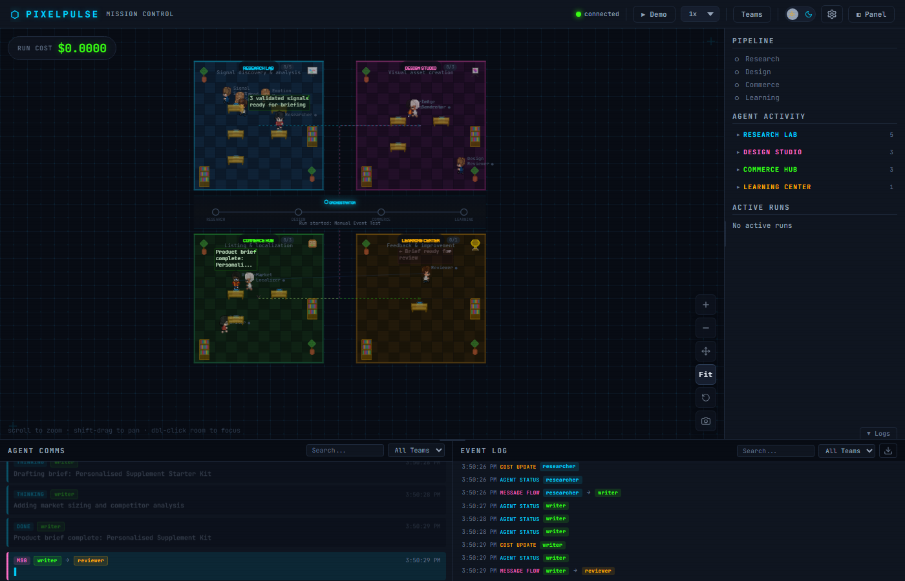
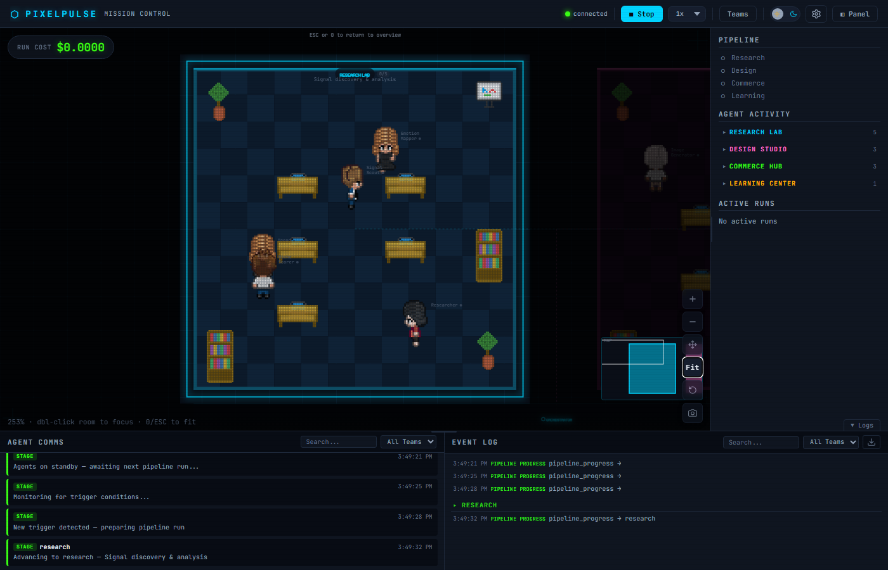
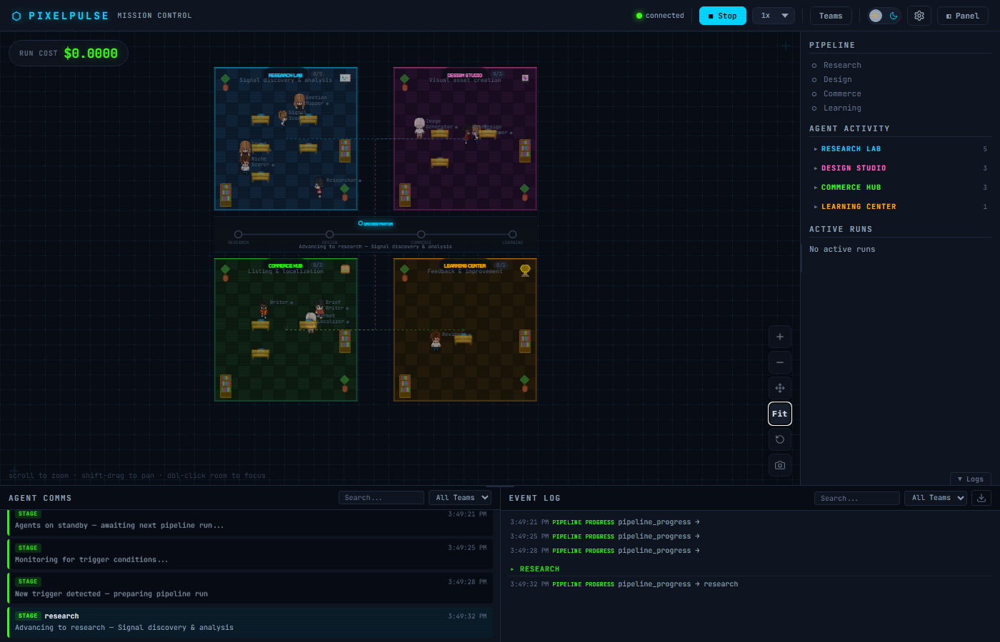
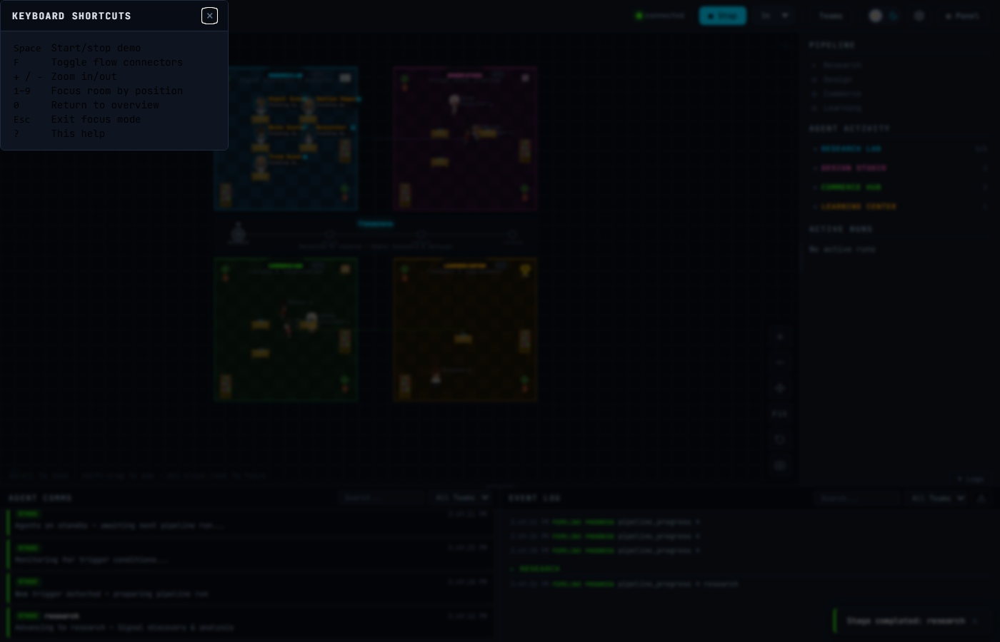

# PixelPulse

Real-time pixel-art dashboard for multi-agent systems. Production observability meets engaging visualization.

[](https://pypi.org/project/pixelpulse/)
[](https://pypi.org/project/pixelpulse/)
[](LICENSE)
[](https://github.com/RevanKumarD/pixelpulse/actions/workflows/ci.yml)
[](tests/)



```
pip install pixelpulse
```

## Quick Start

```python
from pixelpulse import PixelPulse

pp = PixelPulse(
    agents={
        "researcher": {"team": "research", "role": "Finds information"},
        "writer": {"team": "content", "role": "Writes articles"},
    },
    teams={
        "research": {"label": "Research Lab", "color": "#00d4ff"},
        "content": {"label": "Content Studio", "color": "#ff6ec7"},
    },
)
pp.serve()  # Opens pixel-art dashboard at http://localhost:8765
```

Then emit events from your agent code:

```python
pp.agent_started("researcher", task="Searching for trends")
pp.agent_message("researcher", "writer", content="Found 5 trends", tag="data")
pp.agent_completed("researcher", output="Full research output here")
pp.cost_update("researcher", cost=0.003, tokens_in=1200, tokens_out=400)
```

## Docker

```bash
docker run -p 8765:8765 pixelpulse/pixelpulse
```

Or with Docker Compose (for your own agent script):

```yaml
# docker-compose.yml
services:
  pixelpulse:
    image: pixelpulse/pixelpulse
    ports:
      - "8765:8765"
    volumes:
      - ./my_agents.py:/app/my_agents.py
    command: python /app/my_agents.py
```

## Framework Adapters

### Zero-Config Auto-Detection

```python
pp = PixelPulse(agents={...})
results = pp.auto_instrument()
# {"crewai": True, "langgraph": False, "openai": False, "autogen": False}
pp.serve()
```

### LangGraph

```python
pp = PixelPulse(agents={...})
adapter = pp.adapter("langgraph")
adapter.instrument(compiled_graph)  # Patches invoke/ainvoke
result = graph.invoke({"input": "Hello"})
```

### OpenAI Agents SDK

```python
pp = PixelPulse(agents={...})
adapter = pp.adapter("openai")
adapter.instrument()  # Registers global TracingProcessor
result = Runner.run_sync(agent, "Hello!")
```

### CrewAI

```python
pp = PixelPulse(agents={...})
adapter = pp.adapter("crewai")
adapter.instrument(my_crew)
```

### AutoGen

```python
pp = PixelPulse(agents={...})
adapter = pp.adapter("autogen")
adapter.instrument(runtime)
```

### Claude Code

```python
pp = PixelPulse(agents={...})
adapter = pp.adapter("claude_code")
adapter.instrument()  # Enables /hooks/claude-code HTTP endpoint
# Configure Claude Code hooks to POST to http://localhost:8765/hooks/claude-code
```

### @observe() Decorator

Langfuse-inspired function-level instrumentation:

```python
from pixelpulse import PixelPulse
from pixelpulse.decorators import observe

pp = PixelPulse(agents={...})

@observe(pp, as_type="agent", name="researcher")
def research(query):
    # Automatically emits agent_started, agent_completed, agent_error
    return do_research(query)

@observe(pp, as_type="tool", name="web-search")
def search(q):
    # Emits agent_thinking + artifact_created
    return fetch_results(q)
```

### OpenTelemetry (OTEL)

Ingest spans from any OTEL-instrumented framework:

```python
pp = PixelPulse(agents={...})
pp.serve()
# POST GenAI spans to http://localhost:8765/v1/traces
```

### Generic (any Python agent system)

```python
pp = PixelPulse(agents={...})
pp.agent_started("my-agent", task="Working on it")
pp.agent_thinking("my-agent", thought="Considering options A, B, C...")
pp.agent_message("agent-a", "agent-b", content="Here's the data")
pp.agent_completed("my-agent", output="Done!")
```

## Screenshots

### Agents at Work

*Pixel art agents roaming their team rooms, orchestrator pipeline bar showing stage progression*

### Live Event Tracking

*Speech bubbles, agent-to-agent message particles, cost tracking, and rich event log*

### Focus Mode + Minimap

*Double-click a room to zoom in. Minimap shows viewport position. ESC to return.*

### Flow Connectors

*Dashed pipeline flow lines between rooms show data flow direction (F key toggle)*

## Dynamic Canvas

The dashboard automatically adapts to any number of teams and agents:

- **Auto-grid layout**: `cols = ceil(sqrt(teamCount))` — works from 1 to 20+ teams
- **Room sizing modes**: Uniform, Adaptive (size by agent count), Compact (fixed 9-tile)
- **Focus mode**: Double-click a room to zoom in, ESC to return
- **Collapsible rooms**: Click team label to collapse to a compact badge
- **Minimap**: 160x100px viewport overview with click-to-pan (appears at 5+ teams)
- **Compact overflow**: Rooms with 6+ agents show overflow as head icons with +N badge
- **Dynamic team colors**: Deterministic color generation for arbitrary team IDs
- **Keyboard shortcuts**: F (flow connectors), M (minimap), T (team filter), H (help)

## What You Get

- Animated pixel-art characters representing your agents
- Real-time agent-to-agent communication particles
- Speech bubbles showing agent reasoning
- Pipeline stage progression
- Cost and token tracking per agent
- Rich event log with filtering
- Dark and light themes
- Settings panel with room sizing and orchestrator controls

### Keyboard Shortcuts


## Test Coverage

333 tests across 4 layers:

| Layer | Count | What it proves |
|-------|-------|----------------|
| Unit | 233 | Adapter logic, decorators, protocol, event bus in isolation |
| E2E (graph-level) | 35 | Real LangGraph/OpenAI pipelines with mocked pp boundary |
| Integration | 8 | `pp.agent_started()` → EventBus singleton → `/api/events` wiring |
| Functional | 52 | All 7 adapter paths → real pp → bus → HTTP endpoint, no mocks |

The integration + functional tests are the critical layer: they're the only ones that prove
`emit_sync()` correctly lands events in `/api/events` in a real async context.

## Why PixelPulse?

Production observability tools (AgentOps, Langfuse, Arize Phoenix) have great tracing but boring dashboards.

Pixel-art visualization tools are fun but have zero production utility.

PixelPulse combines both: **engaging visualization + real observability**.

## License

Apache-2.0
