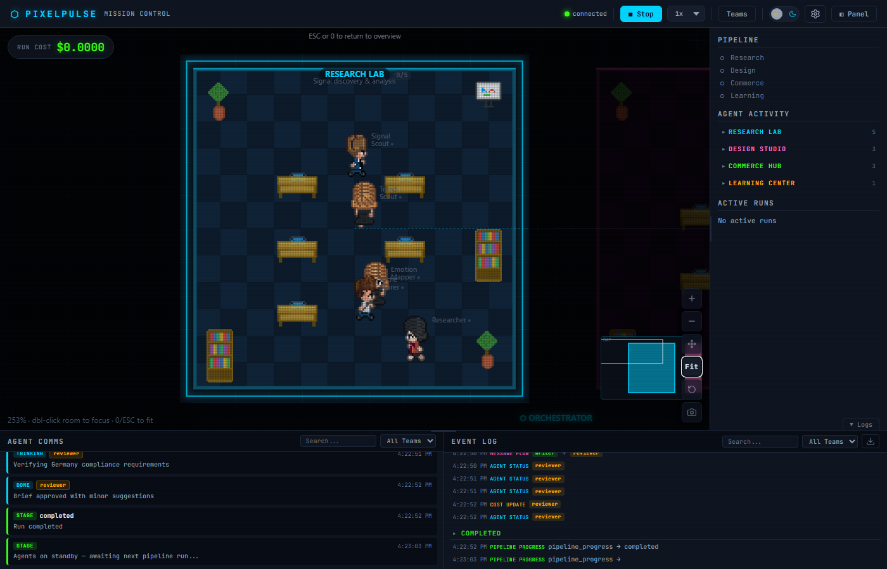

# PixelPulse

**Real-time observability dashboard for multi-agent AI systems — pixel-art meets production monitoring.**

[](https://pypi.org/project/pixelpulse/)
[](https://pypi.org/project/pixelpulse/)
[](LICENSE)
[](https://github.com/RevanKumarD/pixelpulse/actions/workflows/ci.yml)
[](tests/)


> *Agents walk around their team rooms, show speech bubbles when active, and pass messages between rooms. No setup — just `pip install pixelpulse`.*

**[Watch full demo videos](https://github.com/RevanKumarD/pixelpulse/releases/tag/demo-v1)** — 3 scenarios: Software Dev Team, Creative Agency, Data Science Lab

---

## The Problem

You're running a multi-agent system. Something goes wrong. You have no idea which agent failed, what it was given, what it produced, or where the pipeline stalled. Your existing tools give you traces — but reading JSON logs while a live run is in progress is painful.

PixelPulse gives you a **live dashboard** where you can *watch* your agents work: see who's active, what they're thinking, how messages flow between them, and what it's costing you — in real time.

---

## Install

```bash
pip install pixelpulse
```

Works on **macOS, Linux, and Windows** (Python 3.10+).

---

## Quick Start

```python
from pixelpulse import PixelPulse

pp = PixelPulse(
    agents={
        "researcher": {"team": "research", "role": "Finds information"},
        "writer":     {"team": "content",  "role": "Writes articles"},
    },
    teams={
        "research": {"label": "Research Lab",    "color": "#00d4ff"},
        "content":  {"label": "Content Studio",  "color": "#ff6ec7"},
    },
    pipeline=["research", "content"],
)
pp.serve()  # → http://localhost:8765
```

Then emit events from your agent code:

```python
pp.agent_started("researcher", task="Searching for trends")
pp.agent_thinking("researcher", thought="Found 3 promising niches...")
pp.agent_message("researcher", "writer", content="Top pick: eco-denim", tag="data")
pp.cost_update("researcher", cost=0.003, tokens_in=1200, tokens_out=400)
pp.agent_completed("researcher", output="Research complete")
```

Open `http://localhost:8765` — your agents appear as pixel-art characters walking around their team rooms.

---

## Framework Adapters

PixelPulse integrates with all major agent frameworks. Pick the one that matches your stack:

| Framework | Adapter | How it works |
|-----------|---------|--------------|
| **LangGraph** | `pp.adapter("langgraph")` | Wraps `graph.invoke/ainvoke`, auto-maps nodes to agents |
| **CrewAI** | `pp.adapter("crewai")` | Patches `crew.kickoff()`, `step_callback`, `task_callback` |
| **AutoGen** (agentchat) | `pp.adapter("autogen")` | Wraps `team.run_stream()` async generator |
| **OpenAI Agents SDK** | `pp.adapter("openai")` | Registers a `TracingProcessor` (no code changes needed) |
| **@observe decorator** | `from pixelpulse.decorators import observe` | Decorator-based, framework-agnostic |
| **OpenTelemetry (OTEL)** | Built-in endpoint | POST GenAI spans to `/v1/traces` |
| **Claude Code hooks** | Built-in endpoint | POST hooks to `/hooks/claude-code` |
| **Generic / Manual** | Direct `pp.*()` calls | Works with any Python agent system |

### LangGraph

```python
adapter = pp.adapter("langgraph")
adapter.instrument(compiled_graph)
result = graph.invoke({"topic": "AI trends"})
```

### CrewAI

```python
adapter = pp.adapter("crewai")
adapter.instrument(crew)
crew.kickoff()
```

### AutoGen

```python
adapter = pp.adapter("autogen")
adapter.instrument(team)
async for msg in team.run_stream(task="Research AI trends"):
    pass
```

### OpenAI Agents SDK

```python
adapter = pp.adapter("openai")
adapter.instrument()  # registers globally — no other changes needed
result = Runner.run_sync(agent, "What are the latest AI agent frameworks?")
```

### @observe Decorator

```python
from pixelpulse.decorators import observe

@observe(pp, as_type="agent", name="researcher")
def research(query: str) -> str:
    return call_llm(query)  # start/complete events emitted automatically

@observe(pp, as_type="tool", name="web-search")
def search(q: str) -> str:
    return fetch_results(q)  # thinking + artifact events
```

### OpenTelemetry

Any framework that exports OTEL GenAI spans works automatically:

```bash
OTEL_EXPORTER_OTLP_ENDPOINT=http://localhost:8765 python my_agents.py
```

Or POST directly:

```python
import httpx
httpx.post("http://localhost:8765/v1/traces", content=serialized_proto)
```

### Claude Code Hooks

Add to your `.claude/settings.json`:

```json
{
  "hooks": {
    "PreToolUse":  [{"matcher": "*", "hooks": [{"type": "command", "command": "curl -s -X POST http://localhost:8765/hooks/claude-code -H 'Content-Type: application/json' -d @-"}]}],
    "PostToolUse": [{"matcher": "*", "hooks": [{"type": "command", "command": "curl -s -X POST http://localhost:8765/hooks/claude-code -H 'Content-Type: application/json' -d @-"}]}]
  }
}
```

---

## What You See

| Feature | Description |
|---------|-------------|
| **Pixel-art agents** | Animated characters that walk, work at desks, and roam their rooms |
| **Speech bubbles** | Agent reasoning and messages appear as word-wrapped bubbles |
| **Message particles** | Glowing dots fly between agents when messages are sent |
| **Pipeline tracker** | Central orchestrator bar shows which stage is active |
| **Cost counter** | Live per-agent and total cost with token breakdown |
| **Event log** | Timestamped, filterable log of all agent events |
| **Focus mode** | Double-click any room to zoom in; ESC to return |
| **Minimap** | Overview of all rooms with click-to-pan (5+ teams) |
| **Dark + Light themes** | Full theme support |
| **Room sizing modes** | Uniform, Adaptive (by agent count), or Compact |
| **Collapsible rooms** | Click team label to collapse to a compact badge |

### Live Demo

The animation at the top shows a full pipeline cycle in demo mode. Individual states below:

### Screenshots

**Agents at work** — researcher, writer, reviewer moving through their pipeline stages:


**Message flow** — particles flying between agents, speech bubbles, live event log:


**Focus mode** — double-click a room to zoom in and inspect individual agents:


**Flow connectors** — press F to show dashed pipeline arrows between rooms:


---

## Setup by Platform

### macOS / Linux

```bash
python3 -m venv .venv
source .venv/bin/activate
pip install pixelpulse

# With specific framework adapters:
pip install "pixelpulse[langgraph]"   # LangGraph
pip install "pixelpulse[otel]"        # OpenTelemetry
```

### Windows

```powershell
python -m venv .venv
.venv\Scripts\activate
pip install pixelpulse

# PowerShell with LangGraph:
pip install "pixelpulse[langgraph]"
```

### Docker

```bash
docker run -p 8765:8765 pixelpulse/pixelpulse
```

Or mount your agent script:

```yaml
# docker-compose.yml
services:
  pixelpulse:
    image: pixelpulse/pixelpulse
    ports:
      - "8765:8765"
    environment:
      - OPENAI_API_KEY=${OPENAI_API_KEY}
    volumes:
      - ./my_agents.py:/app/my_agents.py
    command: python /app/my_agents.py
```

---

## Configuration Reference

```python
pp = PixelPulse(
    agents={
        "agent-id": {
            "team": "team-id",        # which room to place agent in
            "role": "Role description", # shown in agent card
        }
    },
    teams={
        "team-id": {
            "label": "Display Name",   # room header label
            "color": "#00d4ff",        # room accent color (hex)
        }
    },
    pipeline=["stage-a", "stage-b"],   # ordered list of pipeline stages
    title="My Dashboard",              # browser tab title
)

pp.serve(port=8765, open_browser=True)  # start dashboard
```

### Event API

```python
pp.run_started(run_id, name="Run name")
pp.run_completed(run_id, status="completed", total_cost=0.01)
pp.stage_entered(stage_name, run_id=run_id)
pp.stage_exited(stage_name, run_id=run_id)

pp.agent_started(agent_id, task="What the agent is doing")
pp.agent_thinking(agent_id, thought="Agent's internal reasoning")
pp.agent_completed(agent_id, output="What the agent produced")
pp.agent_error(agent_id, error="Error message")

pp.agent_message(from_agent, to_agent, content="Message text", tag="data")
pp.cost_update(agent_id, cost=0.005, tokens_in=1000, tokens_out=300, model="gpt-4o-mini")
pp.artifact_created(agent_id, artifact_type="text", content="Output content")
```

### HTTP API

```
GET  /api/health          → {"status": "ok"}
GET  /api/events          → last 50 dashboard events
GET  /api/config          → teams, agents, pipeline config
WS   /ws/events           → real-time event stream
POST /v1/traces           → OTEL span ingestion
POST /hooks/claude-code   → Claude Code hook endpoint
```

---

## Keyboard Shortcuts

| Key | Action |
|-----|--------|
| `F` | Toggle flow connectors |
| `M` | Toggle minimap |
| `T` | Filter teams |
| `0` / `ESC` | Fit all rooms in view |
| `+` / `-` | Zoom in / out |
| `H` | Help overlay |
| Double-click room | Focus mode |

---

## Roadmap

### v0.3 — Usability (current focus)
- [ ] Agent click → detail panel with last input/output and full event history
- [ ] Larger, readable fonts at all zoom levels (landed in this release)
- [ ] Better screenshot quality for documentation

### v0.4 — Depth
- [ ] Replay mode — scrub through a recorded run
- [ ] Persistent run history with SQLite backend
- [ ] Structured output display (JSON/markdown rendered in detail panel)

### v0.5 — Integrations
- [ ] Langchain adapter
- [ ] Semantic Kernel adapter
- [ ] n8n workflow integration

### v1.0 — Distribution
- [ ] VS Code extension (watch your Claude Code session live)
- [ ] PyPI stable release with versioned API
- [ ] Hosted cloud option (optional, privacy-first)

---

## Test Coverage

333 tests across 4 layers:

| Layer | Count | What it proves |
|-------|-------|----------------|
| Unit | 233 | Adapter logic, decorators, protocol, event bus in isolation |
| E2E (graph-level) | 35 | Real LangGraph/OpenAI pipelines with mocked pp boundary |
| Integration | 8 | `pp.agent_started()` → EventBus → `/api/events` wiring |
| Functional | 52 | All 7 adapter paths → real pp → bus → HTTP, no mocks |

---

## Why PixelPulse?

Production observability tools (AgentOps, Langfuse, Arize Phoenix) have great tracing but opaque dashboards that require post-run analysis. Pixel-art visualization tools are engaging but have no production utility.

PixelPulse is the first tool that gives you both: **real observability during a live run**, in a format that's actually enjoyable to watch.

---

## Contributing

See [CONTRIBUTING.md](CONTRIBUTING.md) for development setup, test instructions, and how to write a new adapter.

## License

Apache-2.0 — [RevanKumarD/pixelpulse](https://github.com/RevanKumarD/pixelpulse)
