<div align="center">

<br/>

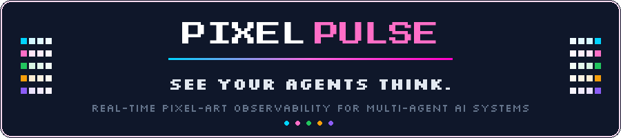

<br/><br/>

<a href="https://pypi.org/project/pixelpulse-dashboard/"></a>&nbsp;
<a href="https://pypi.org/project/pixelpulse-dashboard/"></a>&nbsp;
<a href="https://marketplace.visualstudio.com/items?itemName=revankumard.pixelpulse"></a>&nbsp;
<a href="https://github.com/RevanKumarD/pixelpulse/actions/workflows/ci.yml"></a>&nbsp;
&nbsp;
<a href="LICENSE"></a>

<br/><br/>

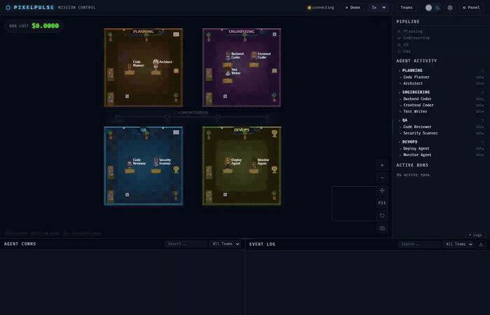

<br/><br/>

[Install](#-install) · [Quick Start](#-30-second-start) · [8 Adapters](#-plug-into-any-framework) · [Screenshots](#-see-it-in-action) · [API](#-the-full-api) · [Roadmap](#%EF%B8%8F-roadmap)

[Demo Videos](https://github.com/RevanKumarD/pixelpulse/releases/tag/demo-v1) · [VS Code Extension](https://marketplace.visualstudio.com/items?itemName=revankumard.pixelpulse) · [PyPI](https://pypi.org/project/pixelpulse-dashboard/) · [Issues](https://github.com/RevanKumarD/pixelpulse/issues)

</div>

<br/>

## The Problem

You're running a multi-agent pipeline. Something stalls. Which agent? What was it thinking?

<table>
<tr>
<th width="50%">What exists today</th>
<th width="50%">What PixelPulse adds</th>
</tr>
<tr>
<td>

**Langfuse / AgentOps / Arize** — post-run traces, you find out *after* it fails

**Terminal output** — wall of text, no spatial awareness of who's where

**Custom JSON logging** — grep soup, no visual indication of data flow

**Grafana** — metrics without semantics, latency not *reasoning*

</td>
<td>

&check; See *who* is active — spatially, in real time<br/>
&check; Read *what* they're thinking — speech bubbles<br/>
&check; Watch *where* data flows — glowing particles<br/>
&check; Track *how much* it costs — live token counters<br/>
&check; Know *which stage* you're in — pipeline tracker<br/>
&check; Works with **any** Python agent framework

</td>
</tr>
</table>

<br/>

## &#x26A1; Install

```bash
pip install pixelpulse-dashboard
```

No API keys. No config files. No Docker required. Python 3.10+ on any OS.

<details>
<summary><b>Framework extras</b></summary>
<br/>

```bash
pip install "pixelpulse-dashboard[langgraph]"    # LangGraph
pip install "pixelpulse-dashboard[crewai]"       # CrewAI
pip install "pixelpulse-dashboard[openai]"       # OpenAI Agents SDK
pip install "pixelpulse-dashboard[autogen]"      # AutoGen
pip install "pixelpulse-dashboard[otel]"         # OpenTelemetry
pip install "pixelpulse-dashboard[all]"          # Everything
```
</details>

<br/>

## &#x1F680; 30-Second Start

```python
from pixelpulse import PixelPulse

pp = PixelPulse(
    agents={
        "researcher": {"team": "research", "role": "Finds information"},
        "writer":     {"team": "content",  "role": "Writes articles"},
    },
    teams={
        "research": {"label": "Research Lab",    "color": "#00d4ff"},
        "content":  {"label": "Content Studio",  "color": "#ff6ec7"},
    },
    pipeline=["research", "content"],
)
pp.serve()  # --> http://localhost:8765
```

```python
pp.agent_started("researcher", task="Searching for trends")
pp.agent_thinking("researcher", thought="Found 3 promising niches...")
pp.agent_message("researcher", "writer", content="Top pick: eco-denim", tag="data")
pp.agent_completed("researcher", output="Research complete")
```

Open `localhost:8765`. Your agents are walking around their office.

<br/>

## &#x1F3A8; See It in Action

<div align="center">
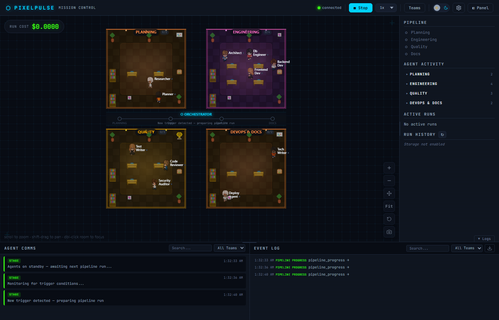
<br/>
<sub><b>4 teams active</b> · pipeline progressing · event log streaming · cost tracking live</sub>
</div>

<br/>

<table>
<tr>
<td width="50%">

&#x1F3AD; **Pixel-art agents** — Characters walk, sit at desks, roam furnished rooms with warm lighting and team-colored accents. Not a static grid — they *move*.

&#x1F4AC; **Speech bubbles** — See exactly what each agent is thinking. Word-wrapped, positioned, real-time.

&#x2728; **Message particles** — Glowing dots fly between rooms when agents communicate. Data flow made *spatial*.

&#x1F4CA; **Pipeline tracker** — Orchestrator bar shows which stage is active with progress indicators.

</td>
<td width="50%">

&#x1F4B0; **Live cost counter** — Per-agent and total cost with token breakdown. Updated on every LLM call.

&#x1F4DC; **Rich event log** — Timestamped, searchable, filterable. Color-coded type badges. Exportable.

&#x1F50D; **Focus mode** — Double-click any room to zoom in. Minimap shows position. ESC to return.

&#x1F464; **Agent detail panel** — Click any agent for 4-tab deep dive: overview, messages, reasoning, performance.

</td>
</tr>
</table>

<details>
<summary><b>Screenshot gallery</b></summary>
<br/>

<table>
<tr>
<td align="center">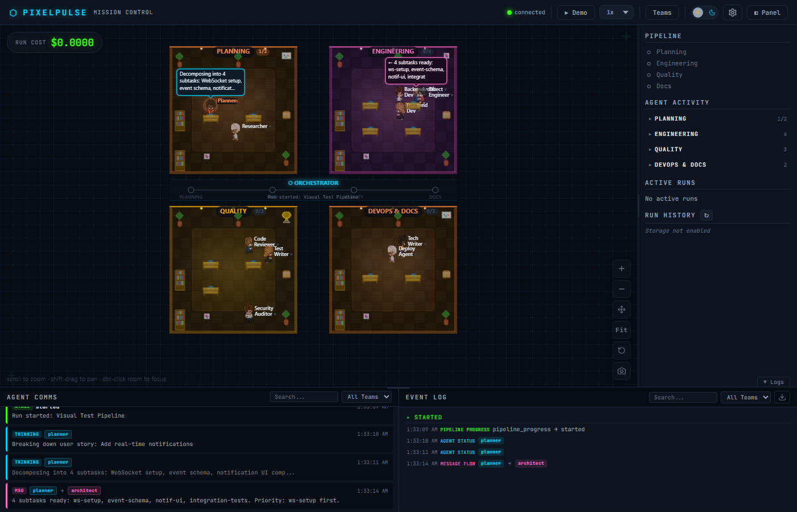<br/><sub>Message particles between rooms</sub></td>
<td align="center">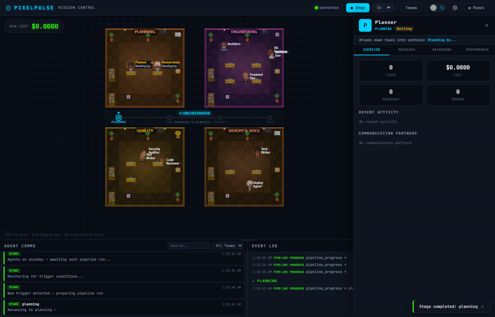<br/><sub>Agent detail panel</sub></td>
</tr>
<tr>
<td align="center">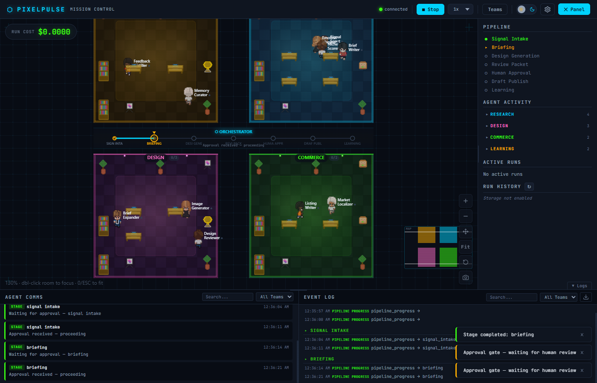<br/><sub>Focus mode with minimap</sub></td>
<td align="center">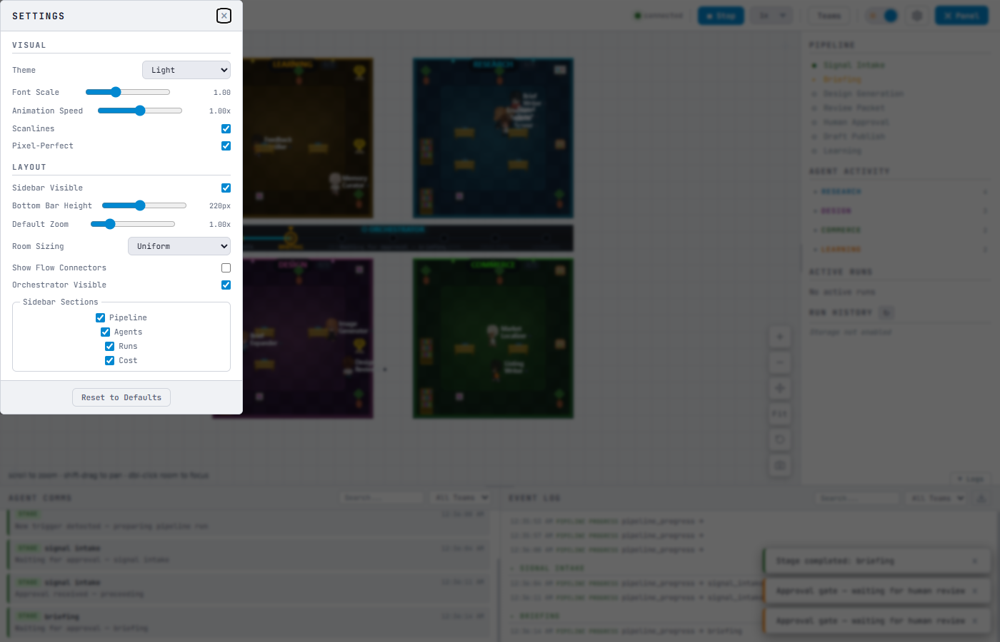<br/><sub>Light theme</sub></td>
</tr>
<tr>
<td align="center">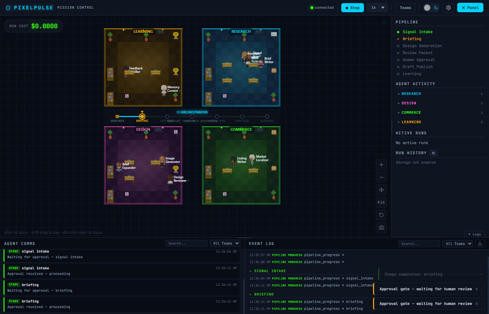<br/><sub>Flow connectors</sub></td>
<td align="center">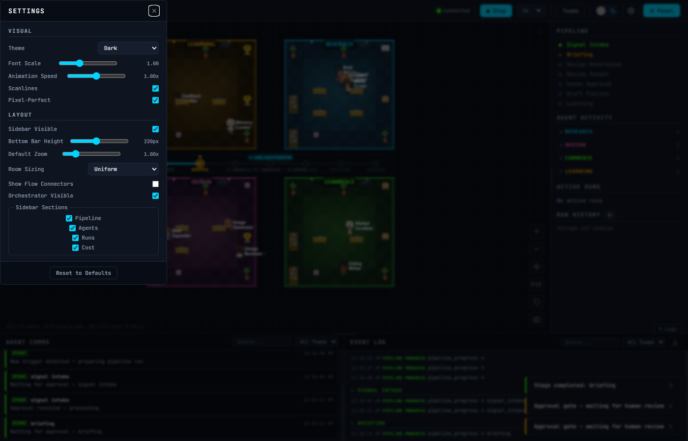<br/><sub>Settings panel</sub></td>
</tr>
<tr>
<td align="center">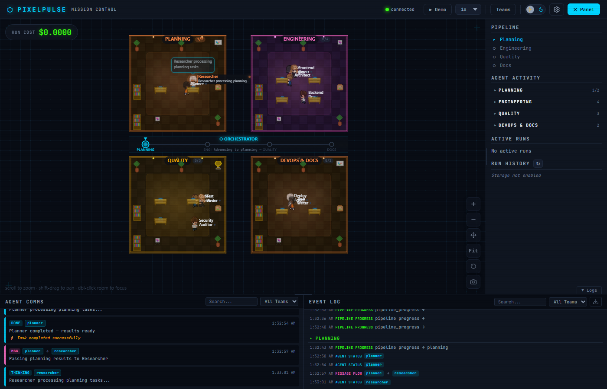<br/><sub>Run history</sub></td>
<td align="center">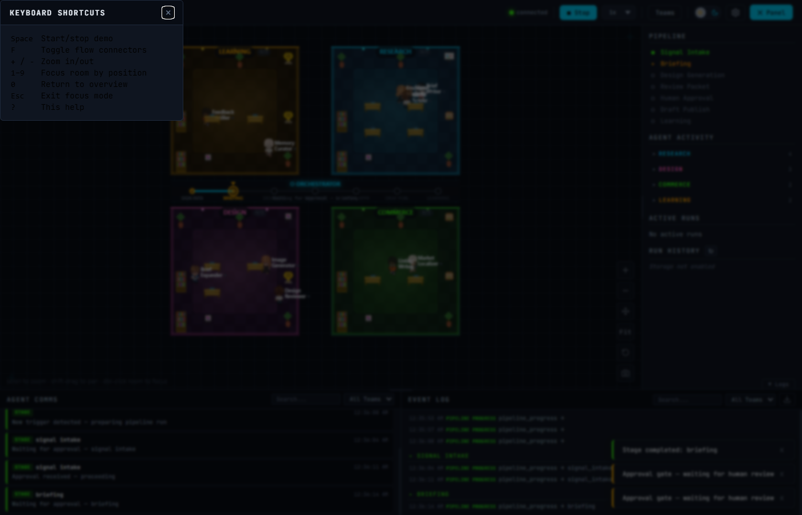<br/><sub>Keyboard shortcuts</sub></td>
</tr>
</table>
</details>

<br/>

## &#x1F50C; Plug Into Any Framework

**2 lines of code. 8 frameworks.**

| Framework | Integration | Lines |
|-----------|-------------|:-----:|
| **LangGraph** | `pp.adapter("langgraph").instrument(graph)` | `2` |
| **CrewAI** | `pp.adapter("crewai").instrument(crew)` | `2` |
| **AutoGen** | `pp.adapter("autogen").instrument(team)` | `2` |
| **OpenAI Agents SDK** | `pp.adapter("openai").instrument()` | `2` |
| **Claude Code** | `claude plugin add plugins/claude-code` | `0` |
| **OpenTelemetry** | Set `OTEL_EXPORTER_OTLP_ENDPOINT` env var | `0` |
| **@observe** | `@observe(pp, as_type="agent")` | `1` |
| **Any Python** | Direct `pp.agent_*()` calls | `~` |

<details>
<summary><b>Full adapter examples</b></summary>
<br/>

**LangGraph**
```python
adapter = pp.adapter("langgraph")
adapter.instrument(compiled_graph)
result = graph.invoke({"topic": "AI trends"})
```

**CrewAI**
```python
adapter = pp.adapter("crewai")
adapter.instrument(crew)
crew.kickoff()
```

**OpenAI Agents SDK**
```python
adapter = pp.adapter("openai")
adapter.instrument()  # registers TracingProcessor globally
result = Runner.run_sync(agent, "What are the latest AI agent frameworks?")
```

**@observe Decorator**
```python
from pixelpulse.decorators import observe

@observe(pp, as_type="agent", name="researcher")
def research(query: str) -> str:
    return call_llm(query)
```

**Claude Code Plugin** — auto-registers all 7 lifecycle hooks, auto-starts server, adds 6 MCP tools. See [plugins/claude-code/README.md](plugins/claude-code/README.md).

**OpenTelemetry** — any framework exporting OTEL GenAI spans works out of the box:
```bash
OTEL_EXPORTER_OTLP_ENDPOINT=http://localhost:8765 python my_agents.py
```
</details>

<br/>

## &#x1F4E1; The Full API

<table>
<tr>
<td width="50%">

**Python Events**

```python
# Lifecycle
pp.run_started(run_id, name="Pipeline run")
pp.run_completed(run_id, total_cost=0.042)
pp.stage_entered("research")

# Agent state
pp.agent_started(id, task="...")
pp.agent_thinking(id, thought="...")
pp.agent_completed(id, output="...")
pp.agent_error(id, error="...")

# Communication
pp.agent_message(from_, to, content="...")
pp.cost_update(id, cost=0.005,
    tokens_in=1000, tokens_out=300)
pp.artifact_created(id,
    artifact_type="code", content="...")
```

</td>
<td width="50%">

**HTTP / WebSocket**

```
GET  /api/health        Health check
GET  /api/events        Last 50 events
GET  /api/config        Teams, agents, pipeline
WS   /ws/events         Real-time stream
POST /v1/traces         OTEL span ingestion
POST /hooks/claude-code Hook endpoint
```

**Configuration**

```python
pp = PixelPulse(
    agents={"id": {"team": "t", "role": "R"}},
    teams={"t": {"label": "Name",
                  "color": "#00d4ff"}},
    pipeline=["stage-a", "stage-b"],
)
pp.serve(port=8765, open_browser=True)
```

</td>
</tr>
</table>

<br/>

## &#x2699; Architecture

| Layer | Tech | Purpose |
|-------|------|---------|
| **Server** | FastAPI + WebSockets | Event ingestion, REST API, real-time push |
| **Storage** | SQLite (aiosqlite) | Persistent run history, event replay |
| **Renderer** | Canvas 2D | 60fps pixel-art: sprites, pathfinding, particles |
| **Adapters** | Protocol-based | Thin per-framework translation (~100 LOC each) |
| **Plugins** | MCP + hooks | Claude Code, VS Code, Codex, Gemini CLI |

<br/>

## &#x2328;&#xFE0F; Keyboard Shortcuts

<div align="center">

<kbd>F</kbd> Flow connectors &ensp;
<kbd>M</kbd> Minimap &ensp;
<kbd>T</kbd> Team filter &ensp;
<kbd>H</kbd> Help &ensp;
<kbd>+</kbd><kbd>-</kbd> Zoom &ensp;
<kbd>0</kbd>/<kbd>ESC</kbd> Fit view &ensp;
<kbd>Double-click</kbd> Focus

</div>

<br/>

## &#x1F9EA; Tests

505 tests across 6 layers:

| Layer | Count | What it proves |
|:------|------:|:---------------|
| **Unit** | 270+ | Adapters, decorators, protocol, event bus, storage |
| **E2E** | 35 | Real LangGraph/OpenAI pipelines |
| **Integration** | 25+ | `pp.agent_started()` &rarr; EventBus &rarr; `/api/events` |
| **Functional** | 52 | All 7 adapters &rarr; real pp &rarr; HTTP, zero mocks |
| **Plugin** | 22 | Hook handler, MCP tools, ensure_server |
| **Visual** | 17 | Playwright: idle, active, themes, errors |

<br/>

## &#x1F5FA;&#xFE0F; Roadmap

**v0.3** *(current)* &mdash; Agent detail panel · Claude Code plugin · SQLite history · Replay · Video export · OTEL · VS Code ext · PyPI

**v0.4** *(next)* &mdash; Codex/Gemini plugins · Cost alerting · Custom sprite packs

**v0.5** &mdash; Langchain · Semantic Kernel · n8n integration

**v1.0** &mdash; Multi-session dashboard · Cloud option · 3D visualization

<br/>

## Contributing

See [CONTRIBUTING.md](CONTRIBUTING.md) for development setup and how to write a new adapter.

<br/>

---

<div align="center">

**Apache-2.0** &mdash; Built by [Revan Kumar D](https://github.com/RevanKumarD)

<sub>If PixelPulse helps you debug your agents faster, consider giving it a &#x2B50;</sub>

</div>
